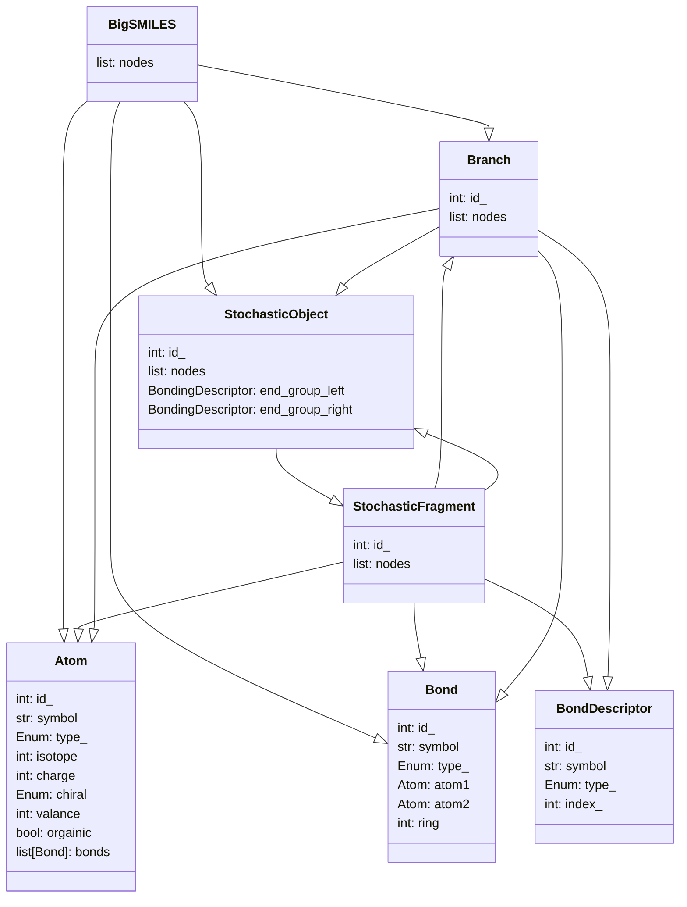

```mermaid
classDiagram

    class BigSMILES {
        list: nodes
    }
    
    
    class StochasticObject {
        int: id_
        list: nodes
        BondingDescriptor: end_group_left
        BondingDescriptor: end_group_right
    }
    
    
    class StochasticFragment {
        int: id_
        list: nodes
    }
    
    
    class Branch {
        int: id_
        list: nodes
    }
    
    
    class BondDescriptor {
        int: id_
        str: symbol
        Enum: type_
        int: index_
    }
    
    
    class Bond {
        int: id_
        str: symbol
        Enum: type_
        Atom: atom1
        Atom: atom2
        int: ring
    }
    
    class Atom {
        int: id_
        str: symbol
        Enum: type_
        int: isotope
        int: charge
        Enum: chiral
        int: valance
        bool: orgainic
        list[Bond]: bonds
    }

    BigSMILES --|> Atom
    BigSMILES --|> Bond
    BigSMILES --|> Branch
    BigSMILES --|> StochasticObject
    StochasticObject --|> StochasticFragment
    StochasticFragment --|> BondDescriptor
    StochasticFragment --|> Atom
    StochasticFragment --|> Bond
    StochasticFragment --|> Branch
    StochasticFragment --|> StochasticObject
    Branch --|> BondDescriptor
    Branch --|> StochasticObject
    Branch --|> Bond
    Branch --|> Atom
    
```
